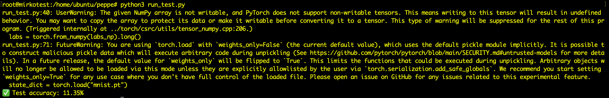
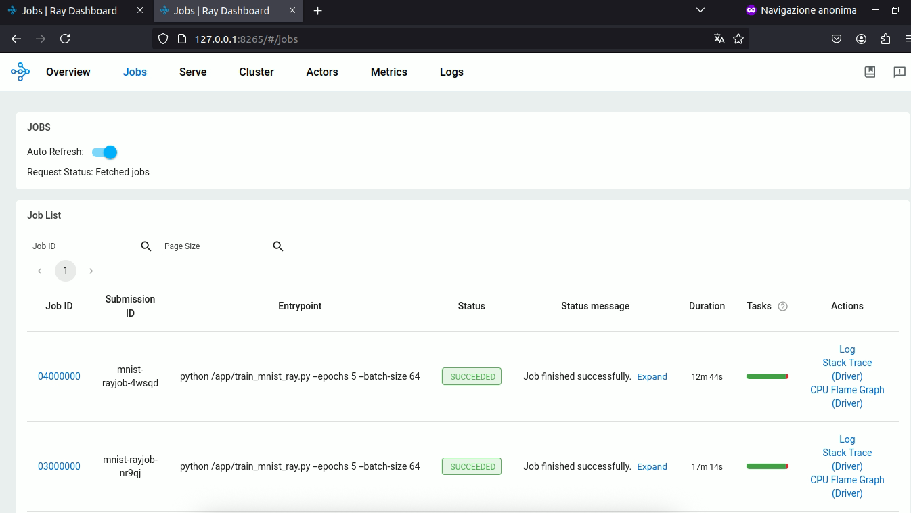

# Introduzione:
Una volta conclusa l'implementazione del cluster Kubernetes, e stabilita una corretta comunicazione tra i vari nodi (masternode & workernodes) ed il server MINIO, si procede con la costruzione del modello di rete neurale, utilizzato per la classificazione delle immagini del dataset MNIST.
Il progetto prevede due fasi principali: l’addestramento e la verifica del modello, gestite rispettivamente dagli script **train_mnist_ray.py** e **run_test.py**, presenti nella directory.
Il primo script (```train_mnist_ray.```) si occupa di stabilire una connessione con il server MINIO per scaricare le immagini e le etichette necessarie all’addestramento. Successivamente, i dati vengono organizzati mediante un dataloader e utilizzati per istruire il modello di rete neurale.

Il secondo script (```run_test.py```), esattamente come il primo, entra in contatto con il server MINIO, da cui però scarica le immagini e le etichette necessarie per il test e il modello generato dall'addestramento. Infine verifica il corretto funzionamento della rete neurale assegnando un valore di Accuracy alle predizioni fatte. 


## Training distribuito:
Il codice esegue un addestramento distribuito di un modello neurale sulla base MNIST, utilizzando dati salvati su un bucket MINIO S3, sfruttando Ray Train per la distribuzione del carico tra più worker. Di seguito si descrive il funzionamento delle principali funzioni presenti nello script e il loro utilizzo nel main: 

### 1. setup_minio_connection():

<pre lang="markdown">

S3_PREFIX = "s3://datasets/mninst" 
ENDPOINT  = os.getenv("AWS_ENDPOINT_URL") 
REGION    = os.getenv("AWS_REGION", "us-east-1")
s3_config = S3ClientConfig(force_path_style=True)

</pre>

Il codice configura l'accesso al bucket MINIO, definendo le variabili necessarie per la connessione.
S3ClientConfig() è fornita dalla libreria s3torchconnecto, che consente di caricare dati direttamente da un bucket compatibile con s3 come **tocrh.utils.data.Dataset**.
Nello specifico S3ClientConfig() configura un client S3 utilizzando la libreria boto3 per accedere al bucket MINIO.


### 2. _download_and_concat()
La funzione scarica i file in memoria e fornisce i contenuti combinati in un singolo oggetto bytes.

Inizialmente viene creato un dataset s3 con il metodo S3MapDataset.from_prefix(). Questo permentte di scaricare dati direttamente da un bucket compatibile con s3 ed usarli come un dataset pyTorch. 

<pre lang="markdown">

ds = S3MapDataset.from_prefix(
    prefix,
    region=REGION,
    endpoint=ENDPOINT,
    transform=None,
    s3client_config=s3_config)

</pre>

Viene formata una lista di coppie del tipo ```["my-bucket", "datasets/mnist/train/part-00001" ]```che viene filtrata per eliminare tutti i file che presentano l'estensione xl.meta (metadati), e successivamente viene ordinata alfabeticamente. 

<pre lang="markdown">

pairs = ds._dataset_bucket_key_pairs
indices = sorted(
    [i for i, entry in enumerate(pairs) if not entry[1].endswith("xl.meta")],
    key=lambda i: pairs[i][1]
)

</pre>

Per ogni elemento della lista "indices" viene aperto l'oggetto di quella lista, viene letto il contenuto e viene concatenato alla lista "buf". Di fatto quello che si sta facendo è una concatenazione di files binari in ram.
NB: Il motivo per cui viene fatta questa cosa, è che in molti casi datasets di grandi dimensioni vengono splittati in più parti nel bucket MINIO. Questa funzione serve per ricostruite il file binario originale così da lavorarci direttamente. (nel nostro caso non serve).


### 3. _parse_idx_images():
La funzione in questione, serve per decodificare i files binari con formato IDX in array Numpy utilizzabili. (Si noti che nella cartella "datasets/mnist" sono presenti due file: "train-images-idx3-ubyte" e "train-labels-idx1-ubyte"). IDX è un formato di file binario utilizzato per rappresentare array multidimensionali.

Il file binario MNIST ha questa struttura:
    - 4 byte: magic number (0x00000803) identifica immagine
    - 4 byte: numero di immagini
    - 4 byte: numero di righe
    - 4 byte: numero di colonne
    - tutti gli altri byte: valori che compongono le immagini

la riga:

<pre lang="markdown">

magic, n, rows, cols = struct.unpack_from(">IIII", bytestream, 0)

</pre>

decodifica i primi 16 byte e li trasforma in una tupla (identificatore_img, numero immagini, numero rows, numero cols). 

infine la riga di codice:

<pre lang="markdown">

data = np.frombuffer(bytestream, dtype=np.uint8, offset=16)
return data.reshape(n, rows, cols)

</pre>

salta i primi 16 bytes dell'header legge i dati rimanenti come array flat (0-255), di dimensioni (n * rows * cols).
Viene effettuato un reshape dell'array flat convertendolo in un tensore (n, rows, cols).


In breve viene effettuato un parsing di un file binario e viene restituito un array Numpy di dimensione (n, rows, cols).


### 4. _parse_idx_labels():
La funzione in question fa esattamente la stessa cosa di _parse_idx_images() però tenendo conto che quello che deve essere parsato è un file di etichette e non un file di immagini.

### 5. make_dataset():
La funzione sfrutta _download_and_concat, _parse_idx_images e _parse_idx_labels per creare un dataset di immagini e etichette. Esattamente quello che ci serve per implementare il training del modello.

Inizialmente viene costruito dinamicamente il path per raggiungere le imagini e le etichette nel  bucket MINIO. A seconda che si stia trattando il training set o il test set

<pre lang="markdown">

img_prefix = f"{S3_PREFIX}/{split}/{'train-images-idx3-ubyte' if split=='train' else 't10k-images-idx3-ubyte'}"
(...)
lbl_prefix = f"{S3_PREFIX}/{split}/{'train-labels-idx1-ubyte'  if split=='train' else 't10k-labels-idx1-ubyte'}"

</pre>

Ottenuti i path a cui riferirsi per il download delle immagini e delle etichette vengono chiamate le funzioni _download_and_concat, _parse_idx_images e _parse_idx_labels.

<pre lang="markdown">

imgs_bytes = _download_and_concat(img_prefix)
labs_bytes = _download_and_concat(lbl_prefix)
(...)
imgs_np = _parse_idx_images(imgs_bytes)       # shape (N,28,28)
labs_np = _parse_idx_labels(labs_bytes) 

</pre>

Infine, dai vari tensori numpy vengono creati i tensori pyTorch, pronti per essere utilizzati nel training del modello. 
Si aggiunge una dimensione al tensore di immagini, perchè pyTorch si aspetta un tensore di dimensione (batch_size, channels, height, width), e dato che le immagini sono in bianco e nero, channel dovrà essere pari ad 1.

### 6. train_loop_per_worker():
Una volta creata la connessione con il bucket MINIO, in cui sono salvati i dati realtivi al dataset MNIST, e conclusa la parte di creazione del dataset da fornire al modello da allenare, si passa alla generazione del loop di addestramento distribuito. 

La funzione **train_loop_per_worker()** è quella che permette di addestrare la rete neurale, splittando il dataset, e quindi il carico di lavoro sui vari workers che compongono il cluster. 

Si parte con la definizione del device su cui verrà eseguito il training, in questo caso si opterà per il device CPU poichè il nostro cluster non presenta alcuna GPU.

<pre lang="markdown">

device = torch.device("cuda" if torch.cuda.is_available() else "cpu")

</pre>

Mediante la funzione **make_dataset()**, che è stata descritta precedentemente, viene creato il dataset di training (si noti l'argomento "train" che verrà utilizzato come split). 

Grazie alla classe di PyTorch **DistributedSampler**, viene creato un sampler che permette di dividere il dataset in parti uguali tra i vari workers. Il suo scopo principale è suddividere automaticamente un dataset tra più processi (o worker) che partecipano a un training distribuito, in modo che ogni processo lavori su una parte diversa del dataset, senza sovrapposizione.
Il numero di Workers viene definito dal numero di repliche descritto nel file di configurazione **raycluster.yaml**.l'informazione viene passata al codice mediante la variabile d'ambiernte "RAY_NUM_WORKERS".

<pre lang="markdown">

ds = make_dataset("train")
sampler = DistributedSampler(ds)

</pre>

Il dataset pronto ad essere distribuito, viene poi passato alla funzione DataLader(), che come argomenti presenta il dataset stesso "ds" e il sampler creato precedentemente. In un training distribuito, ogni processo che viene avviato richiede il proprio DataLoader, ma tutti devono leggere dallo stesso dataset condiviso. Grazie a DistributedSampler ogni processo leggerà solo la parte dei dati che gli spetta.

<pre lang="markdown">

loader = DataLoader(ds, batch_size=cfg["bs"], sampler=sampler, shuffle=False, num_workers=int(os.getenv("RAY_NUM_WORKERS", 2)))

</pre>

A questo punto la funzione **prepare_data_loader()** che proviene dalla libreria ```ray.train.torch```, serve a prepare il DataLoader per l'ambiente distribuito di Ray Training.
In particolare la funzione, verifica se è stato usato un DistributedSampler (altrimenti lo crea in automatico) e fa si che ogni processo ray gestisca il proprio Dataloader in modo corretto.

<pre lang="markdown">

loader = prepare_data_loader(loader)

</pre>

Successivamente anche il modello che verrà costruito dovrà essere preparato per il training distribuito. Per questo una volta definito "model" si utilizza la funzione **prepare_model()**.

Tale funzione fornita da Ray Train trasforma un normale modello PyTorch in una versione pronta per il training distribuito, compatibile con l'ambiente Ray, dietro le quinte prepare_model() fa questo: 
``` model = torch.nn.parallel.DistributedDataParallel(model, device_ids=[local_rank], ...) ```.
In particolare DistributedDataParallel permette di eseguire 2 processi impoertanti che sono:

- Backward pass e sincronizzazione dei gradienti in parallelo
- Ogni processo addestra una copia del modello con i suoi dati, ma i gradienti vengono aggregati automaticamente.

<pre lang="markdown">

 model = nn.Sequential(
        nn.Flatten(),
        nn.Linear(28*28, 128), nn.ReLU(), nn.Dropout(0.2),
        nn.Linear(128, 512), nn.ReLU(), nn.Dropout(0.2),
        nn.Linear(512, 512), nn.ReLU(), nn.Dropout(0.2),
        nn.Linear(512, 512), nn.ReLU(), nn.Dropout(0.2),
        nn.Linear(512, 512), nn.ReLU(), nn.Dropout(0.2),
        nn.Linear(512, 512), nn.ReLU(), nn.Dropout(0.2),
        nn.Linear(512, 512), nn.ReLU(), nn.Dropout(0.2),
        nn.Linear(512, 512), nn.ReLU(), nn.Dropout(0.2),
        nn.Linear(512, 512), nn.ReLU(), nn.Dropout(0.2),
        nn.Linear(512, 512), nn.ReLU(), nn.Dropout(0.2),
        nn.Linear(512, 10)
    ).to(device)

    model = prepare_model(model)

</pre>

Definite la loss_function e il metodo di ottimzzazione, è possibile iniziare il ciclo di addestramento vero e prorpio. Questo viene eseguito per ciascun worker, ognuno dei quali vede solo una parte dei dati di MNIST. Tutto questo grazie a DistributedSampler. Ray invece gestisce in background la sincronizzazione dei pesi tra i vari workernodes dopo ogni backward.

Dietro le quinte, ogni worker esegue questo stesso codice, ma su una diversa posizione del dataset. 
Grazie a prepare_model(), il modello sincronizza i pesi iniziali ed allinea i gradienti tra i worker. Alla fine di ogni batch, i gradienti vengono combinati prima di aggiornare i pesi. 

<pre lang="markdown">

for epoch in range(cfg["epochs"]):
        sampler.set_epoch(epoch) # WIP <-- questo serve per lo shuffling
        for imgs, labels in loader:
            imgs, labels = imgs.to(device), labels.to(device)
            optimizer.zero_grad()
            loss_fn(model(imgs), labels).backward()
            optimizer.step()

</pre>


L'ultima parte della funzione è quella che gestisce il salvataggio del modello addestrato e il suo upload su un bucket S3.
Inizialmente viene effettuata una verifica della presenza di un processo distribuito mediante ```dist.is_available() and dist.is_initialized()```, se entrambe le condzioni sono vere e quindi il training distribuito è attivo, viene salvato il valore del rank, ovvero l'indice del processo corrente. (rank 0 è il master node, mentre i rank 1 e oltre sono i worker nodes). 

Per capire: il codice in questione viene effettuato in maniera distribuita su tutti i nodi. Ognuno di questi nodi ha un valore associato al rank, in poarticolare se mi trovo nel nodo master allora rank = 0 altrimenti rank = 1, 2, 3, ecc. 

<pre lang="markdown">
if dist.is_available() and dist.is_initialized():
        rank = dist.get_rank()

</pre>


Solo il nodo che verifica ```dist.get_rank() == 0```proseguirà con il salvataggio del modello, mentre gli altri nodi non faranno nulla. Nello specifico il modello verrà salvato nella cartella temporanea ```/tmp/model/mnist.pt```.

<pre lang="markdown">

if rank == 0:
        os.makedirs("/tmp/model", exist_ok=True)
        model_path = "/tmp/model/mnist.pt"
        torch.save(model.state_dict(), model_path)
        print(f"✔ Model saved to {model_path}")

</pre>


L'ultimo step è l'upload del modello salvato su di un bucket S3.

<pre lang="markdown">

s3_client.upload_file(model_path, "models", "mnist/mnist.pt")

</pre>

### 7. main();
Nel main si trova la parte centrale della configurazione e dell'avvio del training distribuito mediante Ray. Utilizzando la classe **TorchTrainer**, viene avviato l'addestramento distribuito di un modello **PyTorch** in modo semplice e scalabile.

In particolare, viene istanziato un oggetto trainer tramite la classe **TorchTrainer**, specificando come funzione di training la **train_loop_per_worker**. Questa funzione viene eseguita in parallelo da ciascun worker all'interno del job distribuito.

Attraverso il parametro **train_loop_config** viene passato un dizionario contenente tutti gli iperparametri necessari al training, come il batch size, il learning rate e il numero di epoche.

La distribuzione del training sui diversi nodi è gestita da **ScalingConfig**, che specifica il numero di worker da avviare (determinato dalla variabile d'ambiente **RAY_NUM_WORKERS**) e l'eventuale utilizzo della GPU. Ray si occuperà automaticamente di creare il numero di processi specificato e di distribuirli sui nodi disponibili, gestendo anche l'inizializzazione del contesto distribuito di PyTorch (torch.distributed).

<pre lang="markdown">

  trainer = TorchTrainer(
        train_loop_per_worker,
        train_loop_config={"bs": batch_size, "lr": 1e-3, "epochs": epochs},
        scaling_config=ScalingConfig(
            num_workers=int(os.getenv("RAY_NUM_WORKERS", 2)), 
            use_gpu=torch.cuda.is_available(),
        )
    )

</pre>

## Test del modello:
Una volta completato il training distribuito, il modello addestrato viene automaticamente caricato nel bucket S3 di MINIO.

Prima di eseguire il codice per verificare la capacità predittiva del modello — effettuando quindi inferenze sul dataset di test — è necessario scaricare localmente il modello dal bucket S3. Questo passaggio è fondamentale affinché il file test_model.py possa accedere al modello e utilizzarlo per effettuare le predizioni.

Per eseguire questa operazione, si utilizza uno script bash denominato **download_trained_model.sh**, il quale esegue due comandi fondamentali. Il primo consente di scaricare il file del modello dal bucket S3, salvandolo temporaneamente nella directory ```mnist/mnist.pt.``` Il secondo comando provvede a spostare il file nella directory di lavoro corrente.

I comandi eseguiti dallo script sono i seguenti:

<pre lang="markdown">

python3 buckethandler.py --endpoint  https://minio.131.154.98.45.myip.cloud.infn.it --bucket models download --file mnist/mnist.pt

mv mnist/mnist.pt mnist.pt

</pre>

Una volta che il modello è stato scaricato e reso disponibile localmente, è possibile eseguire il comando seguente per avviare la fase di test:

<pre lang="markdown">

python3 run_test.py

</pre>

Questo comando utilizza il modello, addestrato in modalità distribuita, per effettuare predizioni sul dataset di test. L'output del test dovrebbe essere simile al seguente: 

È importante sottolineare che l’obiettivo principale di questo progetto non è ottenere un modello altamente performante in termini di accuratezza, ma piuttosto dimostrare la corretta esecuzione di un processo di training distribuito su cluster.

Come si può osservare dall’output, il modello presenta una bassa accuratezza sul dataset di test, il che è indicativo di un caso estremo di overfitting. Questo comportamento è dovuto alla struttura del modello utilizzato, che è molto profonda e contiene un numero elevato di hidden layers. Tale configurazione porta il modello a memorizzare il dataset di training, senza riuscire a generalizzare su dati non visti.

L’impiego di una rete così profonda non è stato scelto per finalità prestazionali, bensì per finalità dimostrative: grazie alla sua complessità, è stato possibile osservare in maniera chiara e misurabile le differenze nei tempi di addestramento tra un cluster con soli 2 worker e uno con 8 worker.  

In questo modo, si è potuto evidenziare l’impatto della parallelizzazione sull'efficienza del training, che rappresenta il vero fulcro dell’intero esperimento.


