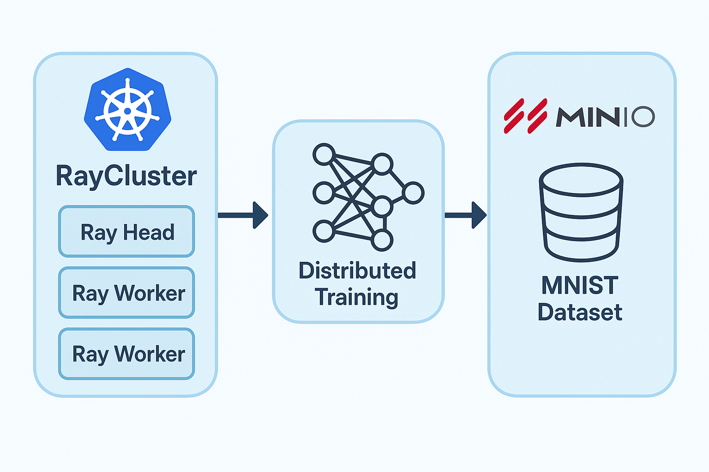

 

Non ho Capito bene cosa sia Il Docker File...

Scaletta dei vari steps fatti che devono esere ben spiegati per esame:
- [ ] Spiega BuildingLuster.txt e DockerFile
- [ ] Spiega i files che si torvano dentro il K8s folder
    - [ ] Raycluster.yaml
    - [ ] Rayjob.yaml
    - [ ] Service-account.yaml
- [ ] Spiega il file dentro utils, buckethandler.py
- [ ] Spiega il Dataset e la connessione al db minio, magari il buckethandler.py
- [ ] Spiega il file train_mnist.py
- [ ] Spiega il run_test.py

- Ricordati che devi fare vedere i vari logs che ottieni, magari mostrando anche qualche screenshot che hai ottenuto. 
- Ricorda che devi mostrare tutti i comandi che hai fatto per creare il cluster e tutti i comandi che vengono utilizzati da terminale per runnare i jobs, come: kubectl apply -f raycluster.yaml, kubectl apply -f rayjob.yaml, kubectl get pods, kubectl logs <pod_name>, ecc...

